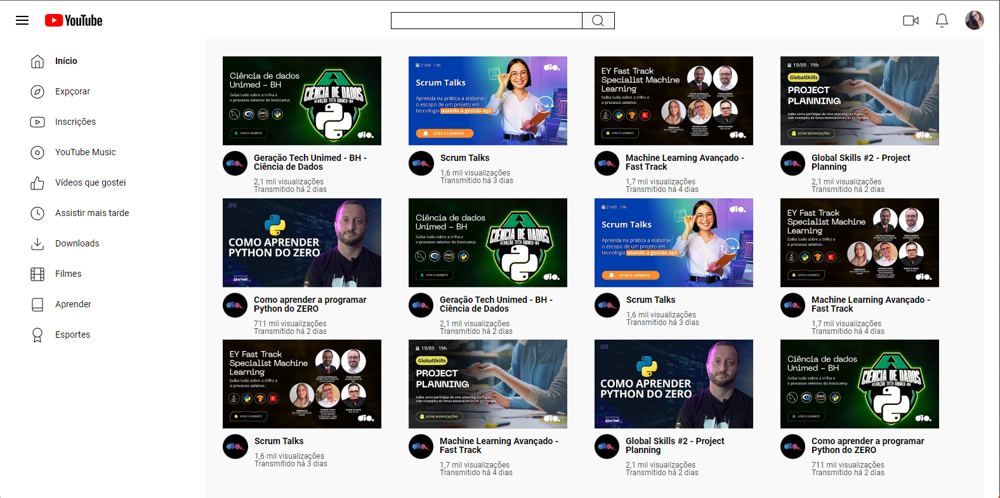

# Entrega de projeto - Reproduzindo a Listagem do YouTube com Grid Layout no CSS | DIO
Neste desafio, você terá a oportunidade de colocar em prática os conceitos aprendidos, especialmente sobre Grid Layout, para construir uma página de listagem de vídeos no estilo do YouTube.

### Tecnologias Utilizadas
- HTML
- CSS (com ênfase em Flexbox)

### Para ver a página
[Link do projeto](https://fabiocasadossites.github.io/desafio-3-css-dio/)
